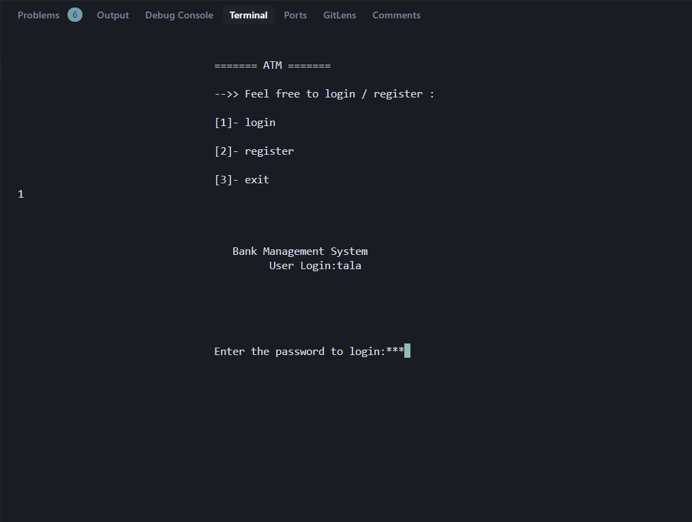
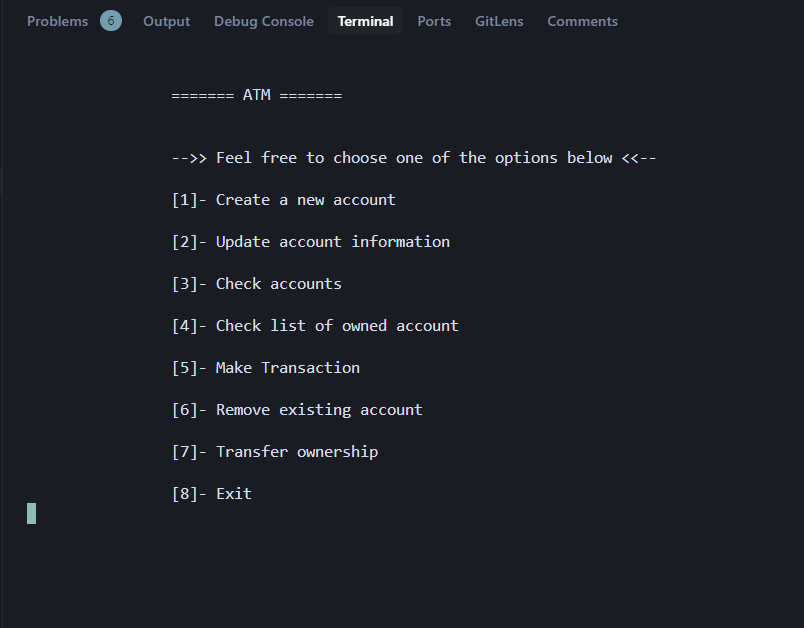
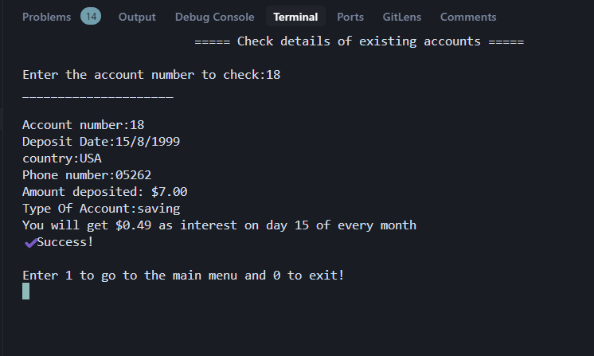
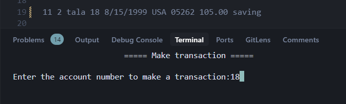
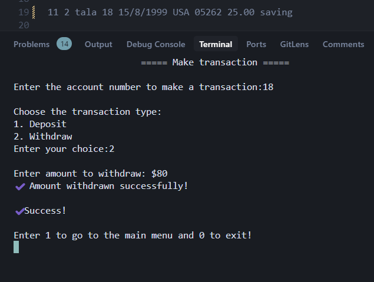
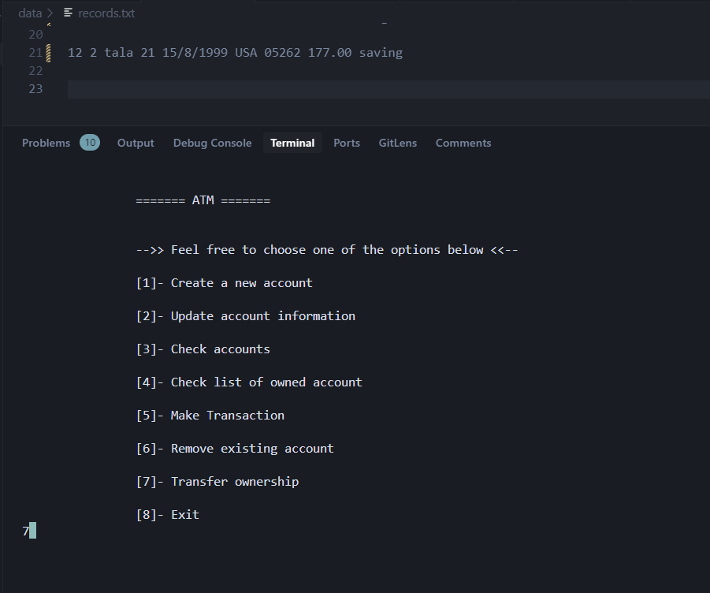
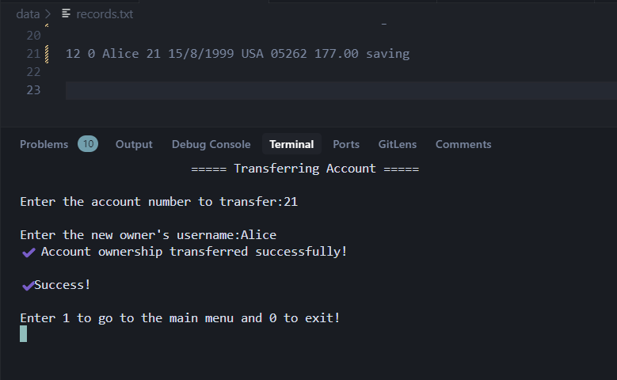

# 💳 ATM Management System (in C)

Welcome to my **ATM Management System**, built in the C programming language as part of a solo project for the University of Notre Dame's Adam Program — applying what I learned in my Computer Engineering course at Birzeit University.

This project was both a challenge and an opportunity to sharpen my programming logic, adapt to a new language, and understand file-based data management in a realistic scenario.

---

## 🧠 Objective

The objective of this project is to demonstrate proficiency in **C programming**, and the ability to:

- Understand and improve existing codebases
- Implement new features from specifications
- Work with file systems for data storage and retrieval

---

## 🏗️ Features Implemented

✅ **Login & Register**  
✅ **Create New Bank Accounts**  
✅ **Check Owned Accounts List**  
✅ **Update Account Info** *(country and phone number)*  
✅ **Check Account Details** with interest calculation  
✅ **Make Transactions** *(deposit/withdraw)*  
✅ **Remove Existing Accounts**  
✅ **Transfer Ownership of Accounts**

---

## 📂 File System Structure

```bash
.
├── data
│   ├── records.txt       # Stores account info
│   └── users.txt         # Stores user login data
└── src
    ├── auth.c
    ├── header.h
    ├── main.c
    └── system.c
```

---

## 📄 File Format

### users.txt

```bash

[id] [name] [password]

Example:
0 Alice 1234password
1 Michel password1234
```

---

### records.txt

```bash
[id] [user_id] [username] [account_id] [creation_date] [country] [phone_number] [balance] [account_type]

Example:
2 0 Alice 1 10/10/2000 Finland 986134231 1234.21 savings
```

---

## 🧮 Interest Calculation

- savings: 7% monthly
- fixed01 (1 year): 4% annual
- fixed02 (2 years): 5% annual
- fixed03 (3 years): 8% annual
- current: No interest

**Example:**

For a savings account with $1023.20 created on `10/10/2002`, the system will output:  
**"You will get $5.97 as interest on day 10 of every month."**

---

## 🔧 How to Compile and Run

```bash
cd src
gcc *.c -o main
./main
```

---

## 🧪 Screenshots

> 📸 **Login & Register**  


> 📸 **Available Actions**  


> 📸 **Interest Display**  


> 📸 **Making A Transaction**  



> 📸 **Transferring Account Ownership**  



---

## 🚀 What I Learned

- Organizing multi-file C programs with headers
- Using file I/O to persist data
- Writing logic-heavy flows like interest calculations
- Building robust CLI tools and managing memory manually
